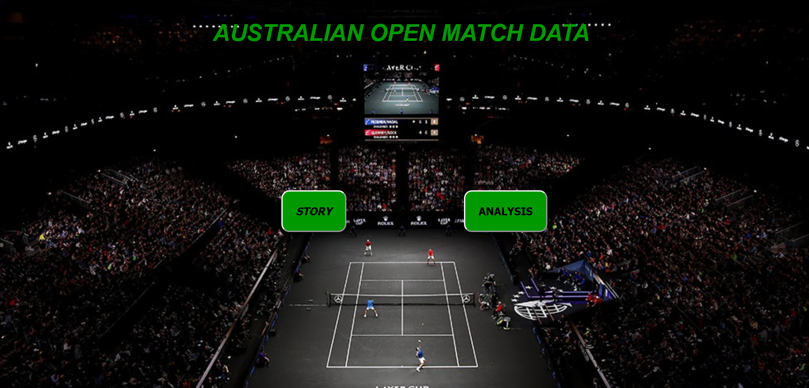
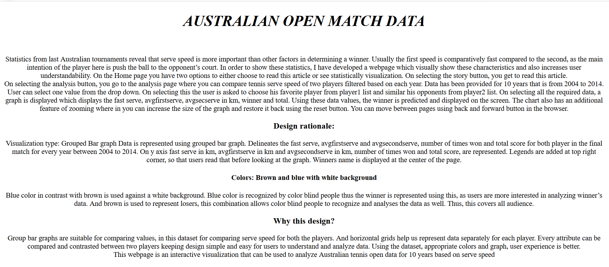
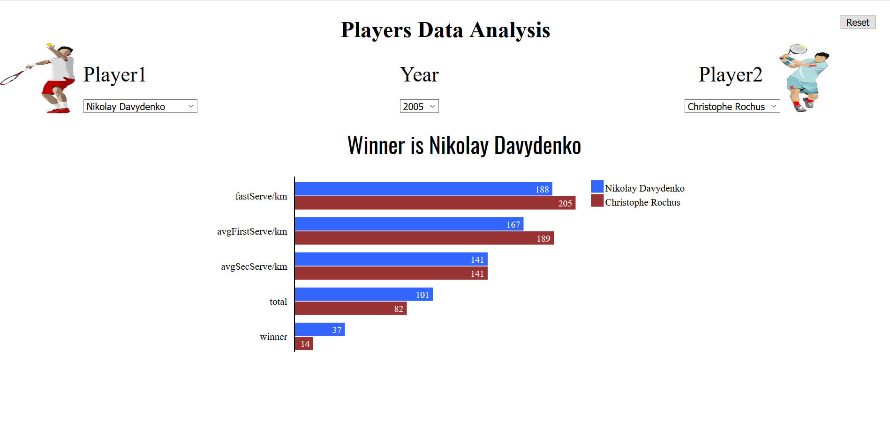

# AnalyseTennisData
A front End Project to analyse 10 years tennis Match data using D3.js

This is a dynamic web project which lets you select the year and 2 players and based on which you get a comaprison of all matches played between them in that particular year.Below are the screenshots of the UI.

#### Home Page: 

#### On selecting Story : 

It gives a brief introduction about tennis and also provides information regarding design patterns used.

#### On selecting Analysis:

You have to select the year from a given dropdown ,then choose player 1 , this would enable a list of player 2 against whom player 1 has played.On selecting player 2 ,a plot is generated as below.
You also have the option to reset it using a reset button on the top left corner.

